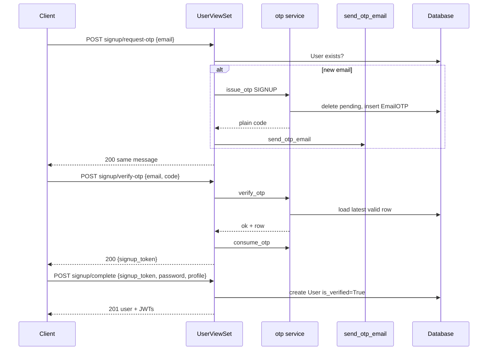

# OTP Authentication Feature — Learning & Reference Guide

This document describes the **email-first signup** and **OTP password reset** implementation in the Noola backend as it exists in the codebase today. It is written so you can **study the design** and **rebuild the same feature from scratch** on another project.

**Base API prefix:** `api/accounts/` (see `noola/urls.py`).  
**Router registration:** `users` → `accounts/urls.py` → all endpoints live under `/api/accounts/users/`.

---

## Table of contents

1. [Inventory: files created or modified](#1-inventory-files-created-or-modified)
2. [Architecture overview](#2-architecture-overview)
3. [Data model](#3-data-model)
4. [Constants and configuration](#4-constants-and-configuration)
5. [Service layer](#5-service-layer)
6. [Serializers](#6-serializers)
7. [Views and HTTP API](#7-views-and-http-api)
8. [End-to-end flows](#8-end-to-end-flows)
9. [Request/response reference](#9-requestresponse-reference)
10. [Security and edge cases](#10-security-and-edge-cases)
11. [Testing with Swagger](#11-testing-with-swagger)
12. [Automated tests in the repo](#12-automated-tests-in-the-repo)
13. [Rebuild checklist (from scratch)](#13-rebuild-checklist-from-scratch)

---

## 1. Inventory: files created or modified

| Path | Role |
|------|------|
| `accounts/models.py` | **Modified** — added `EmailOTPPurpose`, `EmailOTP`; existing `User` unchanged except context (`is_verified` used at signup completion). |
| `accounts/constants.py` | **Modified** — OTP length, TTL, max failed attempts, signup token max age. |
| `accounts/services/__init__.py` | **Created** — re-exports core OTP functions (optional convenience). |
| `accounts/services/otp.py` | **Created** — issue / verify / consume OTP; email normalization; pending OTP cleanup. |
| `accounts/services/email.py` | **Created** — sends OTP email via Django `send_mail` (subjects/body by purpose). |
| `accounts/services/signup_token.py` | **Created** — signed `signup_token` after email OTP verification. |
| `accounts/api/serializers.py` | **Modified** — `is_verified` on read; OTP/signup/reset serializers. |
| `accounts/api/views.py` | **Modified** — five new `@action`s + `AllowAny` wiring; imports services. |
| `accounts/admin.py` | **Modified** — `EmailOTP` registered for inspection. |
| `accounts/migrations/0002_emailotp.py` | **Created** — DB table for `EmailOTP`. |
| `accounts/tests.py` | **Modified** — service-level OTP tests. |
| `noola/settings.py` | **Modified** — JWT auth class, email backend, `DEFAULT_FROM_EMAIL`, signup token TTL from env. |

**Unchanged for routing:** `accounts/urls.py` (still only registers `UserViewSet` as `users`). New endpoints are **extra actions** on that viewset.

**Legacy / unused in the new flow:** `SignupSerializer` remains in `accounts/api/serializers.py` but is **not** wired to any view action in `UserViewSet` (the old one-step signup was replaced by the three-step OTP flow).

---

## 2. Architecture overview

The design separates concerns into four layers:

1. **Persistence (`EmailOTP` model)** — stores hashed codes, expiry, purpose, usage, failed attempts; optional link to `User` for password reset.
2. **Domain / services (`accounts/services/`)** — rules for generating codes, invalidating old pending OTPs, verifying, consuming; email sending; signup completion signing.
3. **API contracts (`serializers`)** — validate input shapes and encode business rules that belong at the boundary (e.g. parse `signup_token`, ensure email not already registered).
4. **HTTP orchestration (`UserViewSet` actions)** — permissions, call services, map outcomes to HTTP status and messages.

**Why a database-backed OTP (not only cache)?**

- Survives multiple app processes and restarts.
- Auditable in admin and SQL during development.
- Natural place to enforce “single active OTP per email + purpose” and expiry.

**Why hash the OTP in the database?**

- A DB leak does not expose usable codes directly; verification uses Django’s `check_password` against a `make_password` hash (same family of ideas as password storage).

**Why a signed `signup_token` after OTP verify?**

- Signup is **email-first**: no `User` row exists until the final step. After OTP verification, you need a **server-issued proof** that this email completed OTP; otherwise anyone could POST password + profile for an arbitrary email and create an account. The token binds completion to the verified email and expires (see `TimestampSigner` + `max_age`).

---

## 3. Data model

### 3.1 `EmailOTPPurpose` and `EmailOTP`

Defined in `accounts/models.py`:

```14:50:accounts/models.py
class EmailOTPPurpose(models.TextChoices):
    SIGNUP = "signup", "Signup email verification"
    PASSWORD_RESET = "password_reset", "Password reset"


class EmailOTP(models.Model):
    """
    One row per issued OTP. Plain code is never stored; only a password-style hash.
    """

    email = models.EmailField(db_index=True)
    user = models.ForeignKey(
        settings.AUTH_USER_MODEL,
        on_delete=models.CASCADE,
        null=True,
        blank=True,
        related_name="email_otps",
    )
    purpose = models.CharField(
        max_length=32,
        choices=EmailOTPPurpose.choices,
        db_index=True,
    )
    code_hash = models.CharField(max_length=128)
    created_at = models.DateTimeField(auto_now_add=True)
    expires_at = models.DateTimeField(db_index=True)
    used_at = models.DateTimeField(null=True, blank=True)
    failed_attempts = models.PositiveSmallIntegerField(default=0)

    class Meta:
        ordering = ["-created_at"]
        indexes = [
            models.Index(fields=["email", "purpose", "-created_at"]),
        ]

    def __str__(self):
        return f"{self.email} ({self.purpose}) {self.created_at}"
```

**Field-by-field intent**

| Field | Purpose |
|--------|---------|
| `email` | Always set; normalized to lowercase in services. Used for signup (no user yet) and reset. |
| `user` | Optional; set on password reset when you already have a `User`. Useful for admin/debug and future constraints. |
| `purpose` | Distinguishes `signup` vs `password_reset` so codes are not interchangeable. |
| `code_hash` | Stores `make_password(plain_code)` — never the plaintext code. |
| `expires_at` | OTP invalid after this time (timezone-aware). |
| `used_at` | Non-null means consumed; prevents reuse. |
| `failed_attempts` | Wrong guesses; capped by `OTP_MAX_FAILED_ATTEMPTS` in `verify_otp`. |

**`User.is_verified`**

Still on `User` (existing field). **`SignupCompleteSerializer`** sets `is_verified=True` when creating the user after a valid `signup_token`, reflecting “email ownership was proven via OTP.”

---

## 4. Constants and configuration

### 4.1 `accounts/constants.py`

```1:5:accounts/constants.py
# OTP / signup completion (override via env in settings if needed)
OTP_CODE_LENGTH = 6
OTP_VALID_MINUTES = 15
OTP_MAX_FAILED_ATTEMPTS = 5
SIGNUP_COMPLETION_TOKEN_MAX_AGE_SECONDS = 30 * 60
```

**Why centralize here?** One place to tune security vs UX; `settings.py` can override token TTL via environment without forking code.

### 4.2 `noola/settings.py` (excerpt)

```89:110:noola/settings.py
REST_FRAMEWORK = {
    "DEFAULT_SCHEMA_CLASS": "drf_spectacular.openapi.AutoSchema",
    "DEFAULT_AUTHENTICATION_CLASSES": (
        "rest_framework_simplejwt.authentication.JWTAuthentication",
    ),
}

# Email (OTP). In DEBUG, console backend prints messages to the runserver terminal.
_default_email_backend = (
    "django.core.mail.backends.console.EmailBackend"
    if DEBUG
    else "django.core.mail.backends.smtp.EmailBackend"
)
EMAIL_BACKEND = env("EMAIL_BACKEND", default=_default_email_backend)
DEFAULT_FROM_EMAIL = env("DEFAULT_FROM_EMAIL", default="noreply@localhost")

from accounts.constants import SIGNUP_COMPLETION_TOKEN_MAX_AGE_SECONDS

SIGNUP_COMPLETION_TOKEN_MAX_AGE_SECONDS = env.int(
    "SIGNUP_COMPLETION_TOKEN_MAX_AGE_SECONDS",
    default=SIGNUP_COMPLETION_TOKEN_MAX_AGE_SECONDS,
)
```

**Why JWT in `DEFAULT_AUTHENTICATION_CLASSES`?** Endpoints like `GET/PATCH /users/me/` expect a Bearer access token from SimpleJWT. Without this, valid tokens from `login` or `signup_complete` would not authenticate DRF requests.

**Why console email when `DEBUG=True`?** You can run the server without SMTP; OTP content appears in the terminal output from `send_mail`.

---

## 5. Service layer

### 5.1 OTP lifecycle — `accounts/services/otp.py`

**Normalize email** (single canonical form for lookups):

```15:16:accounts/services/otp.py
def normalize_email(email: str) -> str:
    return email.lower().strip()
```

**Generate numeric code** (cryptographic RNG, not `random`):

```19:20:accounts/services/otp.py
def _generate_code() -> str:
    return "".join(secrets.choice(string.digits) for _ in range(OTP_CODE_LENGTH))
```

**Invalidate pending OTPs** before issuing a new one for the same `(email, purpose)`:

```23:28:accounts/services/otp.py
def _delete_pending_otps(email: str, purpose: str) -> None:
    EmailOTP.objects.filter(
        email=email,
        purpose=purpose,
        used_at__isnull=True,
    ).delete()
```

**Why delete instead of marking “superseded”?** Simplicity: only one pending row per channel; avoids ambiguity about which code is valid.

**Issue OTP** — validates purpose against enum values, deletes pending, hashes code, sets expiry:

```31:56:accounts/services/otp.py
def issue_otp(
    *,
    email: str,
    purpose: str,
    user=None,
) -> tuple[EmailOTP, str]:
    """
    Create a new OTP; removes any previous pending OTPs for the same email + purpose.
    Returns (instance, plain_code) — plain_code is only for sending by email.
    """
    normalized = normalize_email(email)
    valid = {p.value for p in EmailOTPPurpose}
    if purpose not in valid:
        raise ValueError("invalid purpose")

    _delete_pending_otps(normalized, purpose)
    plain = _generate_code()
    expires_at = timezone.now() + timezone.timedelta(minutes=OTP_VALID_MINUTES)
    otp = EmailOTP.objects.create(
        email=normalized,
        user=user,
        purpose=purpose,
        code_hash=make_password(plain),
        expires_at=expires_at,
    )
    return otp, plain
```

**Verify OTP** — picks latest valid row, enforces attempt cap, compares hash:

```62:92:accounts/services/otp.py
def verify_otp(*, email: str, purpose: str, plain_code: str) -> VerifyResult:
    """
    Returns (ok, otp_or_none, error_code).
    error_code: ok | not_found | expired | wrong_code | locked
    """
    normalized = normalize_email(email)
    now = timezone.now()
    otp = (
        EmailOTP.objects.filter(
            email=normalized,
            purpose=purpose,
            used_at__isnull=True,
            expires_at__gt=now,
        )
        .order_by("-created_at")
        .first()
    )
    if not otp:
        return False, None, "not_found"

    if otp.failed_attempts >= OTP_MAX_FAILED_ATTEMPTS:
        return False, otp, "locked"

    if not check_password(plain_code, otp.code_hash):
        otp.failed_attempts += 1
        otp.save(update_fields=["failed_attempts"])
        if otp.failed_attempts >= OTP_MAX_FAILED_ATTEMPTS:
            return False, otp, "locked"
        return False, otp, "wrong_code"

    return True, otp, "ok"
```

**Consume OTP** (single-use):

```95:97:accounts/services/otp.py
def consume_otp(otp: EmailOTP) -> None:
    otp.used_at = timezone.now()
    otp.save(update_fields=["used_at"])
```

### 5.2 Email delivery — `accounts/services/email.py`

```11:41:accounts/services/email.py
def send_otp_email(*, to_email: str, purpose: str, plain_code: str) -> None:
    if purpose == EmailOTPPurpose.SIGNUP:
        subject = "Your Noola signup verification code"
        body = (
            f"Your verification code is: {plain_code}\n\n"
            "If you did not request this, you can ignore this email."
        )
    elif purpose == EmailOTPPurpose.PASSWORD_RESET:
        subject = "Your Noola password reset code"
        body = (
            f"Your password reset code is: {plain_code}\n\n"
            "If you did not request a reset, ignore this email."
        )
    else:
        subject = "Your verification code"
        body = f"Your code is: {plain_code}"

    from_email = getattr(
        settings,
        "DEFAULT_FROM_EMAIL",
        "webmaster@localhost",
    )
    send_mail(
        subject,
        body,
        from_email,
        [to_email],
        fail_silently=False,
    )
    if settings.DEBUG:
        logger.debug("OTP email sent to %s (purpose=%s)", to_email, purpose)
```

**Extension point:** Swap `send_mail` for a Celery task or SendGrid/SES client here; OTP service stays unchanged as long as it still calls one function with `(to_email, purpose, plain_code)`.

### 5.3 Signup completion token — `accounts/services/signup_token.py`

```9:29:accounts/services/signup_token.py
def _signer() -> TimestampSigner:
    return TimestampSigner(salt="accounts.signup_completion_v1")


def issue_signup_completion_token(email: str) -> str:
    normalized = email.lower().strip()
    return _signer().sign(normalized)


def parse_signup_completion_token(token: str) -> str:
    max_age = getattr(
        settings,
        "SIGNUP_COMPLETION_TOKEN_MAX_AGE_SECONDS",
        _DEFAULT_SIGNUP_TOKEN_MAX_AGE,
    )
    try:
        return _signer().unsign(token, max_age=max_age)
    except SignatureExpired as e:
        raise ValueError("signup_token_expired") from e
    except BadSignature as e:
        raise ValueError("signup_token_invalid") from e
```

**Why `TimestampSigner`?** Django uses `SECRET_KEY`; `salt` separates this token from other signed payloads. `max_age` enforces TTL without a database row for the token.

**Public package export** (`accounts/services/__init__.py`) only re-exports OTP helpers; email and signup token are imported directly where needed (views vs serializers).

---

## 6. Serializers

### 6.1 `UserReadSerializer` — expose verification state

`is_verified` was added so clients can see whether the account’s email was verified through the OTP signup path:

```7:31:accounts/api/serializers.py
class UserReadSerializer(serializers.ModelSerializer):
    class Meta:
        model = User
        fields = (
            "user_id",
            "email",
            ...
            "updated_at",
            "is_verified",
        )
        read_only_fields = fields
```

### 6.2 Signup steps

| Serializer | Role |
|------------|------|
| `SignupRequestOTPSerializer` | `email` only. |
| `SignupVerifyOTPSerializer` | `email` + `code`. |
| `SignupCompleteSerializer` | `signup_token`, `password`, profile fields; validates token → email; creates user with `is_verified=True`. |

**Critical logic in `SignupCompleteSerializer.validate`:**

```150:169:accounts/api/serializers.py
    def validate(self, attrs):
        from accounts.services.signup_token import parse_signup_completion_token

        attrs = attrs.copy()
        token = attrs.pop("signup_token")
        try:
            email = parse_signup_completion_token(token)
        except ValueError as e:
            msg = (
                "This signup link has expired."
                if str(e) == "signup_token_expired"
                else "Invalid signup token."
            )
            raise serializers.ValidationError({"signup_token": msg}) from e
        if User.objects.filter(email=email).exists():
            raise serializers.ValidationError(
                {"signup_token": "An account with this email already exists."}
            )
        attrs["email"] = email
        return attrs
```

**`create`** uses the email from the token, not from an extra user-supplied email field (prevents swapping email after verification):

```171:179:accounts/api/serializers.py
    def create(self, validated_data):
        password = validated_data.pop("password")
        email = validated_data.pop("email")
        return User.objects.create_user(
            email=email,
            password=password,
            is_verified=True,
            **validated_data,
        )
```

### 6.3 Password reset

- `PasswordResetRequestSerializer` — `email`
- `PasswordResetConfirmSerializer` — `email`, `code`, `new_password`

---

## 7. Views and HTTP API

All new endpoints are **`@action(detail=False)`** methods on `UserViewSet` in `accounts/api/views.py`, with explicit `url_path` segments so URLs read as grouped flows (`signup/...`, `password-reset/...`).

### 7.1 Public actions and permissions

```46:64:accounts/api/views.py
    _PUBLIC_ACTIONS = frozenset(
        {
            "login",
            "signup_request_otp",
            "signup_verify_otp",
            "signup_complete",
            "password_reset_request",
            "password_reset_confirm",
        }
    )

    def get_permissions(self):
        if self.action in self._PUBLIC_ACTIONS:
            return [AllowAny()]

        if self.action == "create":
            return [IsAdminUser()]

        return [IsAuthenticated()]
```

`@action(..., permission_classes=[AllowAny])` duplicates the intent for clarity in OpenAPI; the source of truth for “who can call what” is still `get_permissions`.

### 7.2 Signup: request OTP

```110:122:accounts/api/views.py
    def signup_request_otp(self, request):
        serializer = self.get_serializer(data=request.data)
        serializer.is_valid(raise_exception=True)
        email = normalize_email(serializer.validated_data["email"])
        if User.objects.filter(email=email).exists():
            return Response({"detail": _SIGNUP_OTP_SENT}, status=status.HTTP_200_OK)
        _, plain = issue_otp(email=email, purpose=EmailOTPPurpose.SIGNUP)
        send_otp_email(
            to_email=email,
            purpose=EmailOTPPurpose.SIGNUP,
            plain_code=plain,
        )
        return Response({"detail": _SIGNUP_OTP_SENT}, status=status.HTTP_200_OK)
```

**Note:** The message is **the same** whether the email is already registered or not, but if registered **no OTP is sent** (reduces spam to existing users). That is a deliberate trade-off (slight enumeration via timing or “did I get an email” is still possible).

### 7.3 Signup: verify OTP → `signup_token`

```130:153:accounts/api/views.py
    def signup_verify_otp(self, request):
        serializer = self.get_serializer(data=request.data)
        serializer.is_valid(raise_exception=True)
        email = normalize_email(serializer.validated_data["email"])
        code = serializer.validated_data["code"].strip()
        ok, otp_row, _err = verify_otp(
            email=email,
            purpose=EmailOTPPurpose.SIGNUP,
            plain_code=code,
        )
        if not ok or otp_row is None:
            return Response(
                {"detail": "Invalid or expired verification code."},
                status=status.HTTP_400_BAD_REQUEST,
            )
        consume_otp(otp_row)
        token = issue_signup_completion_token(email)
        return Response(
            {
                "signup_token": token,
                "detail": "Email verified. Submit this token with your password and profile to complete signup.",
            },
            status=status.HTTP_200_OK,
        )
```

OTP is **consumed before** returning the token so the same code cannot be reused to mint multiple tokens.

### 7.4 Signup: complete → JWTs

```161:173:accounts/api/views.py
    def signup_complete(self, request):
        serializer = self.get_serializer(data=request.data)
        serializer.is_valid(raise_exception=True)
        user = serializer.save()
        tokens = RefreshToken.for_user(user)
        return Response(
            {
                "user": UserReadSerializer(user).data,
                "access": str(tokens.access_token),
                "refresh": str(tokens),
            },
            status=status.HTTP_201_CREATED,
        )
```

### 7.5 Password reset: request (no enumeration)

```181:197:accounts/api/views.py
    def password_reset_request(self, request):
        serializer = self.get_serializer(data=request.data)
        serializer.is_valid(raise_exception=True)
        email = normalize_email(serializer.validated_data["email"])
        user = User.objects.filter(email=email).first()
        if user is not None:
            _, plain = issue_otp(
                email=email,
                purpose=EmailOTPPurpose.PASSWORD_RESET,
                user=user,
            )
            send_otp_email(
                to_email=email,
                purpose=EmailOTPPurpose.PASSWORD_RESET,
                plain_code=plain,
            )
        return Response({"detail": _RESET_OTP_SENT}, status=status.HTTP_200_OK)
```

Always **200** with the same `detail` string whether or not the user exists.

### 7.6 Password reset: confirm (transactional)

```205:235:accounts/api/views.py
    def password_reset_confirm(self, request):
        serializer = self.get_serializer(data=request.data)
        serializer.is_valid(raise_exception=True)
        email = normalize_email(serializer.validated_data["email"])
        code = serializer.validated_data["code"].strip()
        new_password = serializer.validated_data["new_password"]
        ok, otp_row, _err = verify_otp(
            email=email,
            purpose=EmailOTPPurpose.PASSWORD_RESET,
            plain_code=code,
        )
        if not ok or otp_row is None:
            return Response(
                {"detail": "Invalid or expired reset code."},
                status=status.HTTP_400_BAD_REQUEST,
            )
        try:
            with transaction.atomic():
                user = User.objects.select_for_update().get(email=email)
                user.set_password(new_password)
                user.save(update_fields=["password"])
                consume_otp(otp_row)
        except User.DoesNotExist:
            return Response(
                {"detail": "Invalid or expired reset code."},
                status=status.HTTP_400_BAD_REQUEST,
            )
        return Response(
            {"detail": "Your password has been reset. You can sign in now."},
            status=status.HTTP_200_OK,
        )
```

**Why `transaction.atomic` + `select_for_update`?** Reduces race windows between password write and OTP consumption; `User.DoesNotExist` is mapped to the **same** error message as bad OTP to avoid leaking whether the email disappeared between steps.

---

## 8. End-to-end flows

### 8.1 Signup (email-first)



### 8.2 Password reset

1. **Request:** `password-reset/request` with `email` → always identical success message; OTP email only if user exists.
2. **Confirm:** `password-reset/confirm` with `email`, `code`, `new_password` → verify `PASSWORD_RESET` OTP, update password, consume OTP.

Signup and reset **do not share** OTP rows because `purpose` differs.

---

## 9. Request/response reference

**Base:** `POST /api/accounts/users/...` (trailing slash depends on `APPEND_SLASH`; DRF router typically uses slashes).

| Step | Path | Body (JSON) | Success |
|------|------|-------------|---------|
| Signup 1 | `signup/request-otp/` | `{"email": "..."}` | `200` `{"detail": "If this email can be used..."}` |
| Signup 2 | `signup/verify-otp/` | `{"email": "...", "code": "..."}` | `200` `{"signup_token": "...", "detail": "..."}` |
| Signup 3 | `signup/complete/` | `signup_token`, `password`, `first_name`, `last_name`, optional `phone_number`, `company_name`, `company_role` | `201` `user`, `access`, `refresh` |
| Reset 1 | `password-reset/request/` | `{"email": "..."}` | `200` `{"detail": "If an account exists..."}` |
| Reset 2 | `password-reset/confirm/` | `email`, `code`, `new_password` | `200` `{"detail": "Your password has been reset..."}` |

**Common errors**

- Signup verify: `400` `{"detail": "Invalid or expired verification code."}`
- Signup complete: `400` field errors on `signup_token` (invalid / expired / duplicate email)
- Reset confirm: `400` `{"detail": "Invalid or expired reset code."}` (covers bad code, missing user, etc.)

---

## 10. Security and edge cases

| Topic | Behavior in this codebase |
|--------|---------------------------|
| OTP entropy | 6-digit numeric code via `secrets` |
| Storage | Hashed with `make_password` / verified with `check_password` |
| Expiry | `OTP_VALID_MINUTES` (15) from issue time |
| Replay | `consume_otp` sets `used_at`; verify requires `used_at IS NULL` |
| Multiple OTPs | Pending rows for same `(email, purpose)` deleted on new `issue_otp` |
| Brute force (per row) | `failed_attempts` incremented on wrong code; locked at `OTP_MAX_FAILED_ATTEMPTS` |
| Signup without token | `signup_complete` requires valid signed token bound to email |
| JWT after signup | Same pattern as `login` — access + refresh returned on `201` |
| Admin inspection | `EmailOTPAdmin` is read-only for all fields — avoids accidental edits to hashes |

**Not implemented (optional hardening)**

- Global rate limiting (DRF throttling) on OTP endpoints
- Constant-time delay on password-reset request to reduce timing signals
- Refresh token rotation / blacklist on password change (SimpleJWT settings)

---

## 11. Testing with Swagger

1. Run the development server (`python manage.py runserver`).
2. Open **`/api/docs/`** (project root redirects there from `/`).
3. Expand **`users`** (or the tag Spectacular assigns to `UserViewSet`).
4. Execute **`POST /api/accounts/users/signup/request-otp/`** with a JSON body `{"email": "you@example.com"}`.
5. With **`DEBUG=True`** and console email backend, read the **six-digit code** from the server terminal.
6. Call **`POST .../signup/verify-otp/`** with `email` and `code`; copy `signup_token` from the response.
7. Call **`POST .../signup/complete/`** with `signup_token`, `password` (≥8 chars), `first_name`, `last_name`, etc.
8. Use **`Authorize`** in Swagger: paste `access` as `Bearer <token>` (or the UI’s expected format) and call **`GET /api/accounts/users/me/`**.

**Password reset**

1. Ensure a user exists (e.g. after signup).
2. `POST .../password-reset/request/` with that email.
3. Read code from console mail output.
4. `POST .../password-reset/confirm/` with `email`, `code`, `new_password`.

---

## 12. Automated tests in the repo

`accounts/tests.py` includes `OTPServiceTests` covering:

- Happy path: issue → verify → consume → second verify fails
- Wrong code yields `wrong_code`
- Password reset purpose with a real `User`

Run:

```bash
python manage.py test accounts
```

---

## 13. Rebuild checklist (from scratch)

Use this order when re-implementing on a greenfield or another repo:

1. **Model** — `EmailOTP` + `purpose` enum; optional `user` FK; indexes on lookup path.
2. **Migration** — apply and verify table in DB.
3. **Constants** — length, TTL, max attempts, token max age.
4. **`otp.py`** — `normalize_email`, `issue_otp` (delete pending + hash + expiry), `verify_otp` (latest row + attempts), `consume_otp`.
5. **`email.py`** — single function calling `send_mail` (or stub).
6. **`signup_token.py`** — `TimestampSigner` issue/parse with salt + `max_age` from settings.
7. **Settings** — `EMAIL_*`, `REST_FRAMEWORK` JWT auth, `SIGNUP_COMPLETION_TOKEN_MAX_AGE_SECONDS`.
8. **Serializers** — request/response shapes; `SignupCompleteSerializer` must derive email **only** from token.
9. **Viewset actions** — wire five routes; same response text for reset request; transactional confirm.
10. **Permissions** — `AllowAny` on all auth-like actions; keep admin-only `create` if you mirror this project.
11. **Admin** — register `EmailOTP` read-only for debugging.
12. **Tests** — service tests first, then API integration tests if desired.

---

## Admin reference

`EmailOTP` listing and detail are configured in `accounts/admin.py` with **all fields read-only** so hashes and metadata are visible but not accidentally corrupted in production admin.

---

*Document version: aligned with the implementation in the repository at the time of writing. For historical notes, see also `docs/OTP_AUTHENTICATION_IMPLEMENTATION.md` (older draft; flow may differ from the email-first design described here).*
